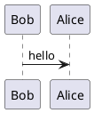

# Hello there this is a great file

This is some markdown

```json
{
    "some": true,
    "json": 123
}
```

## Subtitle

Links [here](https://www.google.com). **Bold**, _italic_, ~~strikethrough~~, `inline code`.

{{feature:test.feature}}

## A diagram


