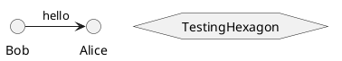

---
# Title can be used as {{ page.title }} in your Twig template
title: Great title

# Controls whether a PDF version of this page is included
pdf: true

# If this is set to an integer, we will update the page content for the corresponding Confluence page
confluencePageId: 1234

# If not specified, defaults to 100
order: 105
---
# Hello there this is a great file

This is some markdown

```json
{
    "some": true,
    "json": 123
}
```

## Subtitle

Links [here](https://www.google.com). **Bold**, _italic_, ~~strikethrough~~, `inline code`.

{{feature:test.feature}}

## Inline some JSON

{{src-json:example.json}}

## A diagram

Test with filename:



Test without filename:

```puml
@startuml
skinparam package {
    BackGroundColor Seashell
}
@enduml
```

## Some images

Here are some images:


They are hand drawn, that's why they look rubbish.

### A larger image

This is an image that's over 500kb so we can be sure that bigger images work:


## Inline PUML file


